# QuoteCraft — System Design

Cross-reference: [PRODUCT_SPEC.md](./PRODUCT_SPEC.md) · [REQUIREMENTS.md](./REQUIREMENTS.md)

---

## Design Principles

Every decision in this document is weighed against four priorities, in order:

1. **Stability** — The embeddable widget runs on other people's websites. If it breaks, we break their business. Widget reliability is non-negotiable.
2. **Security** — We execute our code on other people's domains and handle their customers' data. Every input is hostile until validated. Every trust boundary is enforced. We follow OWASP guidance and design for defense in depth — no single control is the only thing standing between an attacker and a breach.
3. **Low cost of operations** — Free tier is unlimited. Revenue per user is low or zero. Infrastructure cost must scale sub-linearly with user growth.
4. **Low maintenance** — Small team. Prefer managed services over self-hosted. Prefer convention over configuration. Prefer fewer moving parts.
5. **Observability** — When something goes wrong, we need to know before our users do. Structured logging, health checks, and metric collection are first-class concerns, not afterthoughts.

---

## System Overview

QuoteCraft is composed of four deployable units and two data stores. Each unit has a distinct runtime, deployment cadence, and failure domain.

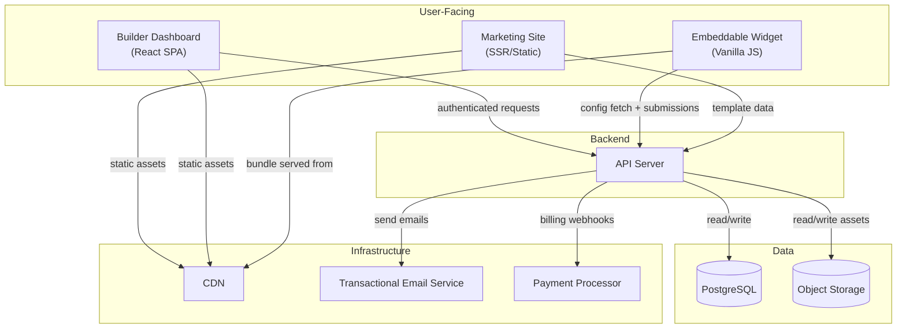

### Deployable Units

| Unit | What It Is | Deployed As | Failure Impact |
|------|-----------|-------------|----------------|
| **Marketing Site** | Template gallery, blog, landing pages, SEO content | Static/SSR site behind CDN | New signups slow down. Existing users unaffected. |
| **Builder Dashboard** | React SPA where builders create and manage calculators | Static bundle behind CDN | Builders can't edit. Existing embeds unaffected. |
| **Embeddable Widget** | Vanilla JS bundle that renders calculators on third-party sites | Versioned bundle on CDN | Direct user impact. Calculators stop rendering if CDN is down. Calculations still work if only API is down. |
| **API Server** | REST API handling auth, CRUD, submissions, billing hooks | Application server(s) behind a load balancer | Builders can't save. Widget can't fetch new configs or log submissions. Existing cached configs still render. |

This separation means **the widget's critical path is CDN → cached config → client-side calculation**. The API server is only needed for config fetches (cacheable) and submission writes (deferrable). A full API outage does not break live calculators.

---

## Embeddable Widget Architecture

The widget is the most critical component. It runs on domains we don't control, in browsers we can't predict, alongside CSS and JavaScript we didn't write. Its design prioritizes isolation, size, and resilience.

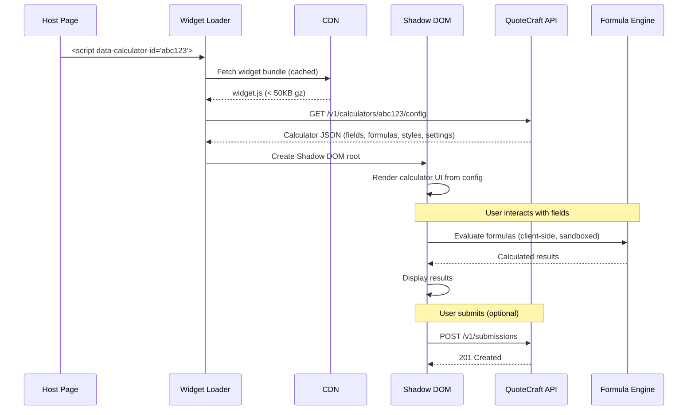

### Widget Loading Strategy

The widget bundle is a single self-contained JavaScript file with no external dependencies. It loads in three stages:

1. **Loader** — The `<script>` tag executes a tiny inline loader (< 2KB) that asynchronously fetches the full widget bundle from the CDN. The `async` attribute ensures it never blocks host page rendering.

2. **Config Fetch** — The widget requests the calculator configuration from the API. This response is cacheable (short TTL, e.g., 5 minutes) and can be served from CDN edge if a caching layer is placed in front of the API. If the fetch fails, the widget retries with exponential backoff up to 3 times, then displays a graceful fallback message.

3. **Render** — The widget creates a Shadow DOM root attached to a container element. All calculator HTML, CSS, and event handling live inside the shadow boundary. This prevents the host page's styles from bleeding in and the widget's styles from leaking out.

### Formula Engine Isolation

The formula engine parses and evaluates builder-defined expressions. Because these expressions are user-authored, the engine must be sandboxed:

- Formulas are parsed into an abstract syntax tree (AST) at build time (in the dashboard) and at render time (in the widget).
- The evaluator walks the AST with an allow-listed set of operations: arithmetic, comparisons, conditionals, and math functions (`MIN`, `MAX`, `ABS`, `ROUND`).
- Variable references resolve against a map of current field values. No other data is accessible.
- The evaluator has no access to `eval()`, `Function()`, the DOM, network APIs, or any browser globals.
- Execution is time-bounded — if evaluation exceeds a threshold (e.g., 100ms), it aborts and surfaces an error.

The same formula engine code is shared between the builder preview and the embedded widget. This guarantees that the preview matches production output exactly.

### Submission Path

When an end user completes a calculator and triggers a submission:

1. The widget collects all field values and calculated outputs into a submission payload.
2. The payload is sent as a POST to the API's submission endpoint.
3. If the POST fails (network error, API down), the widget stores the payload in `localStorage` and retries on the next page load or widget interaction. Submissions are never silently dropped.
4. The API writes the submission to PostgreSQL and, if configured, triggers an email notification to the builder and/or fires outbound webhooks.

---

## Builder Dashboard Architecture

The builder dashboard is a React single-page application. It communicates with the API server exclusively over REST.

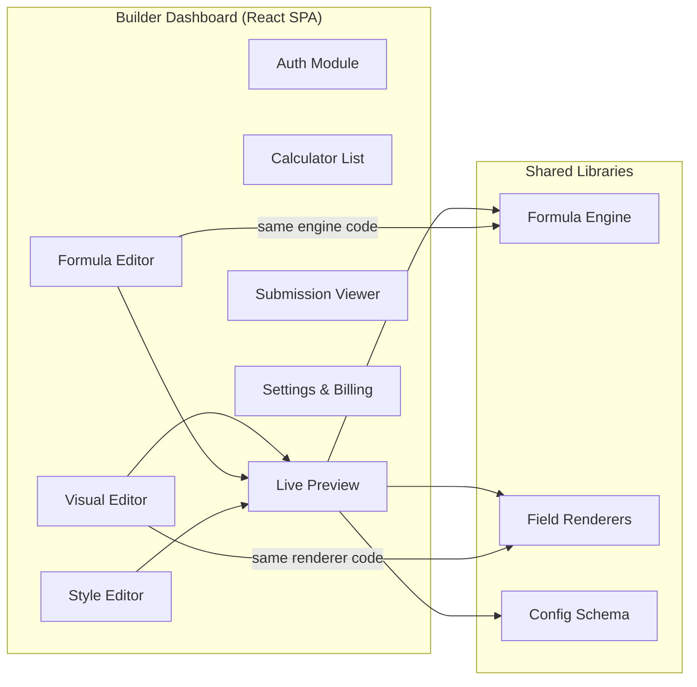

### Shared Code Between Dashboard and Widget

Three modules are shared between the dashboard and the widget at the source level, compiled separately into each bundle:

| Module | Purpose | Used In |
|--------|---------|---------|
| **Formula Engine** | Parses and evaluates expressions | Dashboard preview, Widget |
| **Field Renderers** | Renders each field type (dropdown, slider, etc.) from config JSON | Dashboard preview, Widget |
| **Config Schema** | TypeScript types and validation for calculator configuration JSON | Dashboard (write), Widget (read), API (validate) |

Sharing these modules eliminates preview-to-production drift. What the builder sees is what the end user gets.

### Calculator Configuration Schema

The calculator definition is a single JSON document stored in PostgreSQL. It is the contract between the dashboard (which writes it), the API (which stores and serves it), and the widget (which renders it).

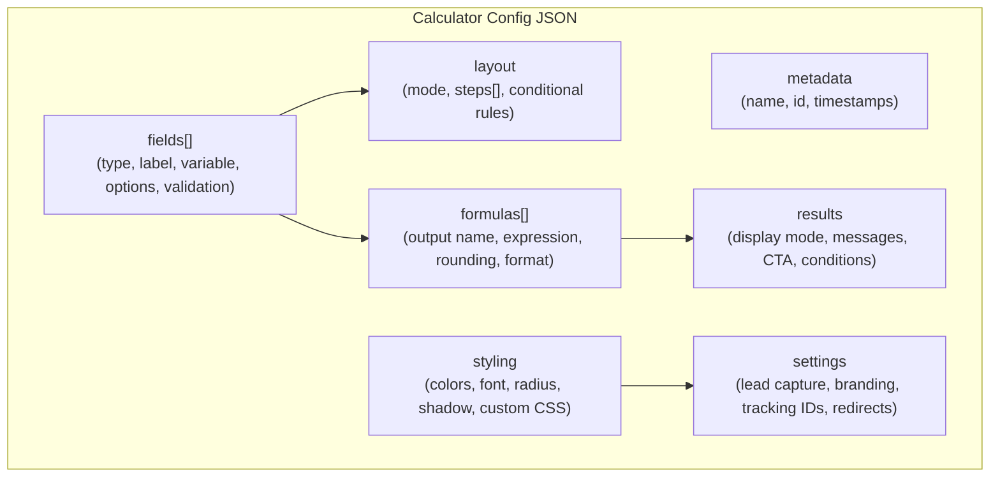

The schema is versioned. When the schema evolves (new field types, new settings), the version number increments. The widget must handle any schema version it encounters — older calculators that haven't been re-saved continue to work. Migration happens lazily: the config is upgraded to the latest schema when the builder next opens and saves it.

---

## API Server Architecture

The API server is a stateless application tier that mediates between the frontend clients and the data layer.

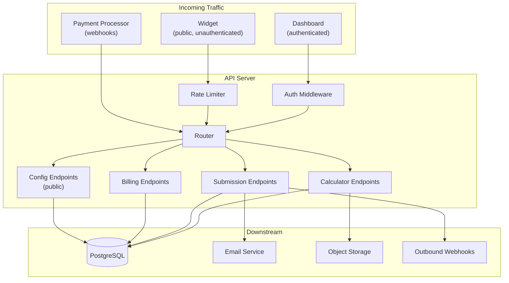

### Endpoint Categories

The API exposes four distinct groups of endpoints with different authentication and performance characteristics:

| Endpoint Group | Auth | Rate Limiting | Caching | Volume |
|---------------|------|--------------|---------|--------|
| **Auth** (`/v1/auth/*`) | Public | Aggressive (by IP) | None | Low |
| **Calculator CRUD** (`/v1/calculators/*`) | Session token | Standard (by user) | None | Low |
| **Config** (`/v1/calculators/:id/config`) | None (public) | Standard (by calculator ID) | CDN-cacheable, short TTL | High |
| **Submissions** (`/v1/submissions`) | None (public) | Aggressive (by IP + calculator ID) | None | High |
| **Billing** (`/v1/billing/*`) | Session token + webhook signatures | Standard | None | Low |

The config and submission endpoints are the only high-volume paths. Config is cacheable. Submissions are write-only and small. This means the API server's load is dominated by simple reads and writes — no heavy computation.

### Rate Limiting Strategy

Rate limiting serves two purposes: abuse prevention and cost control (since the free tier is unlimited).

- **Auth endpoints**: Tight per-IP limits to prevent credential stuffing. Example: 10 attempts per minute per IP.
- **Config endpoints**: Per-calculator-ID limits to prevent abusive scraping. Generous enough that legitimate widget loads are never throttled, even on high-traffic host pages. CDN caching absorbs most of the load before it reaches the API.
- **Submission endpoints**: Per-IP-per-calculator limits to prevent spam submissions. Example: 20 submissions per hour per IP per calculator. This is high enough for legitimate use (a visitor exploring pricing) but blocks automated abuse.

Rate limit state is stored in-memory (per server instance) for the MVP. If the API scales to multiple instances, this moves to a shared in-memory store.

### Feature Gating

Paid features are enforced at the API layer, not the client layer. The API server checks the user's subscription tier before executing tier-gated operations:

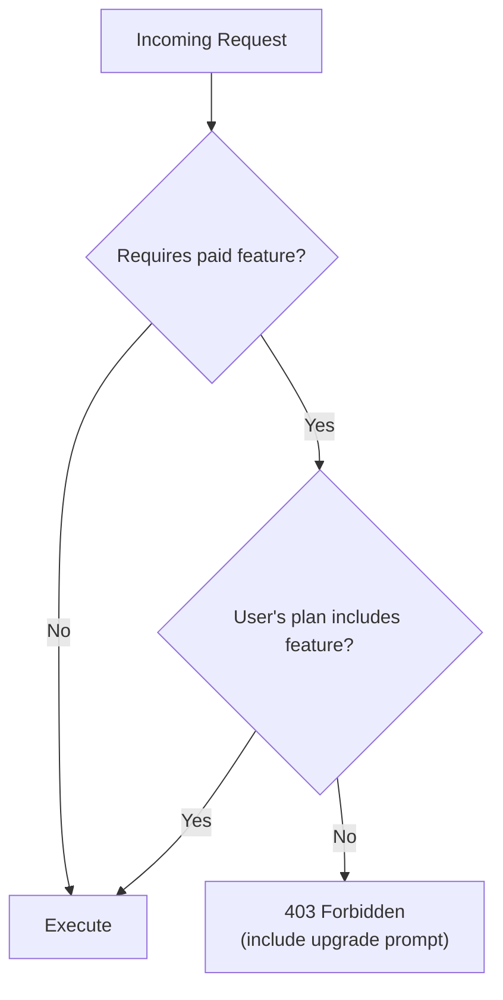

Feature-to-tier mappings are defined in a single configuration table. When the widget fetches a calculator config, the API annotates the response with the builder's active feature set (e.g., `branding_removable: true`). The widget uses these flags to determine behavior (e.g., whether to render the "Powered by" badge).

This means the widget never stores tier information itself and always defers to the API as the source of truth. A builder who cancels their Pro subscription sees the badge reappear on the next config fetch (within the cache TTL window).

---

## Data Model

### Entity Relationships

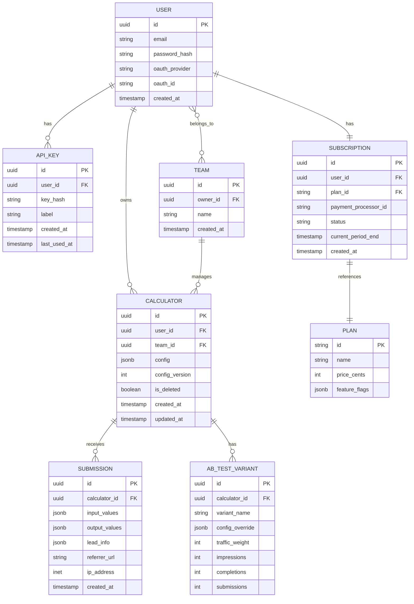

### Storage Considerations

**Calculator Config (`jsonb`)** — Stored as a JSONB column rather than normalized tables. Rationale:
- The config schema is complex, nested, and evolves frequently (new field types, new settings).
- It's always read and written as a whole — never queried by individual field.
- JSONB gives us schema flexibility without migrations for every new feature.
- The config is validated at the application layer before storage.

**Submissions** — Input and output values are also stored as JSONB. Each submission is a snapshot of the calculator's state at the time of submission. If the builder later modifies the calculator, historical submissions remain unchanged.

**Soft Deletes** — Calculators use soft delete (`is_deleted` flag). This allows:
- Immediate cessation of widget rendering (widget checks this flag in the config response).
- Retention of submission data for analytics.
- Possibility of restoration if a builder accidentally deletes.

### Data Retention

| Data Type | Free Tier | Pro | Business/Agency |
|-----------|-----------|-----|-----------------|
| Calculator configs | Indefinite | Indefinite | Indefinite |
| Submissions | 30 days rolling | Unlimited | Unlimited |
| Uploaded assets (logos, images) | Indefinite | Indefinite | Indefinite |
| Analytics events | 30 days | 90 days | 1 year |

The 30-day submission window on the free tier is enforced by a scheduled cleanup job that marks expired rows. Rows are not physically deleted immediately — they're marked expired and purged in batch during low-traffic hours to avoid database pressure spikes.

---

## Content Delivery Architecture

The CDN is the most important piece of infrastructure for both cost and reliability. It serves three categories of content, each with different caching behavior.

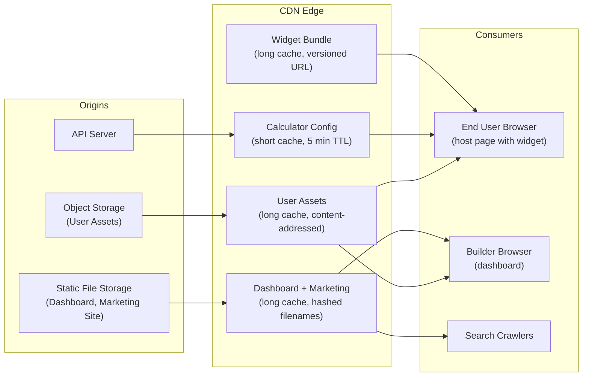

### Caching Strategy

| Asset | Cache TTL | Invalidation | Rationale |
|-------|----------|-------------- |-----------|
| Widget bundle | 1 year | New filename on each build (content hash) | Bundle changes only on deploys. Long cache = fewer origin requests = lower cost. |
| Dashboard/Marketing static files | 1 year | New filename on each build (content hash) | Same as widget. |
| Calculator config JSON | 5 minutes | TTL expiry | Balance between freshness (builder edits should appear quickly) and CDN hit rate. |
| User assets (logos, images) | 1 year | Content-addressed filenames | Assets are immutable once uploaded. If a user uploads a new logo, it gets a new URL. |

The short TTL on calculator config means a builder's changes propagate to all embedded widgets within 5 minutes. This is acceptable for the use case — nobody is editing a calculator and expecting instant updates on their live site. If instant propagation becomes a requirement, the API can issue a CDN purge on save.

### Cost Implications

With long-lived caches on static assets and a CDN-cacheable config endpoint, the API server only handles:
- Dashboard CRUD operations (low volume — builders editing)
- Submission writes (moderate volume — end users submitting)
- Cache-miss config fetches (low volume — CDN absorbs most)

This means the API server's compute needs remain small even as widget impressions grow into the hundreds of thousands. A single modestly-sized server instance can handle the MVP and early growth phases.

---

## Email and Notification System

Email serves two functions: lead notifications (free tier) and PDF quote delivery (Pro tier). Both are transactional, not marketing.

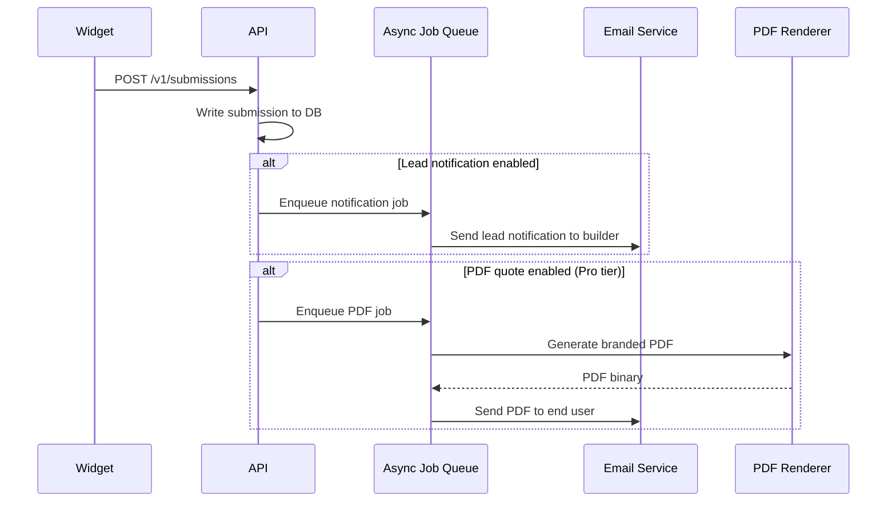

### Asynchronous Processing

Email sending and PDF generation happen asynchronously via a job queue. The submission API endpoint returns immediately after writing to the database and enqueuing jobs. This keeps the submission path fast for the end user and decouples the widget's reliability from the email service's availability.

If the email service is temporarily unavailable, jobs remain in the queue and are retried with exponential backoff. The builder's submission log always reflects the submission regardless of email delivery status.

### PDF Generation

PDF generation (Pro tier) is handled server-side. The renderer takes the submission data (inputs, outputs, line items), the builder's branding (logo, company name, contact info), and a predefined template layout, and produces a PDF document. The renderer operates statelessly — it receives everything it needs as input and produces a PDF binary as output. No persistent state or file system dependencies.

Generated PDFs are not stored long-term. They are generated on demand, attached to the outbound email, and discarded. If re-generation is needed (e.g., the builder wants to preview their PDF template), the renderer is invoked again with the same inputs.

---

## Billing Integration

Subscription management is handled through a third-party payment processor. The API server does not process credit cards, store payment details, or calculate tax. It delegates entirely.

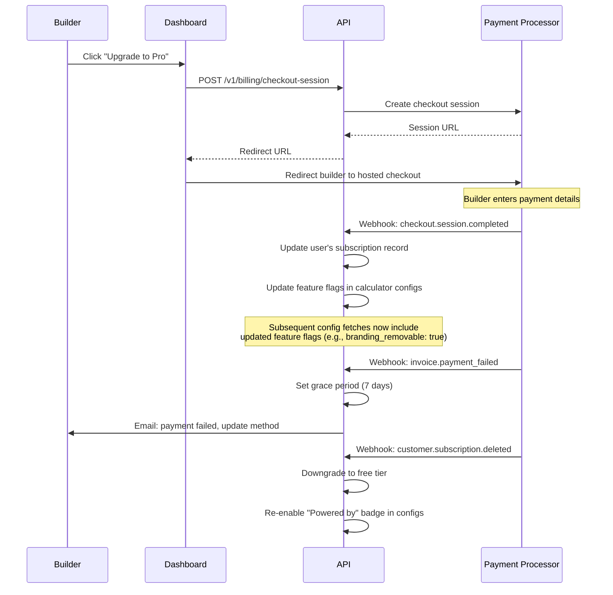

### Webhook Security

All inbound webhooks from the payment processor are validated by checking the cryptographic signature included in the request headers. The API server rejects any webhook that fails signature verification. Webhook endpoints are excluded from standard authentication middleware — they use their own verification scheme.

### Graceful Degradation on Downgrade

When a user's subscription lapses:
1. Feature flags are updated in the database.
2. The next calculator config fetch (within 5 min CDN TTL) reflects the new flags.
3. The widget re-enables the "Powered by" badge.
4. PDF generation stops for new submissions.
5. Submission history reverts to 30-day window (existing data older than 30 days is hidden, not deleted, so it reappears if they resubscribe).
6. CRM integrations and webhooks stop firing.

No data is destroyed on downgrade. If the user resubscribes, everything is restored.

---

## Observability

### Structured Logging

All system components emit structured logs (JSON) with consistent fields:

| Field | Description |
|-------|-------------|
| `timestamp` | ISO 8601 |
| `level` | `debug`, `info`, `warn`, `error` |
| `service` | `api`, `worker`, `cdn` |
| `trace_id` | Request trace ID (propagated from CDN → API → worker) |
| `user_id` | Authenticated user, if applicable |
| `calculator_id` | Relevant calculator, if applicable |
| `endpoint` | API route |
| `status_code` | HTTP response code |
| `duration_ms` | Request duration |
| `error` | Error message and stack, if applicable |

### Health Checks

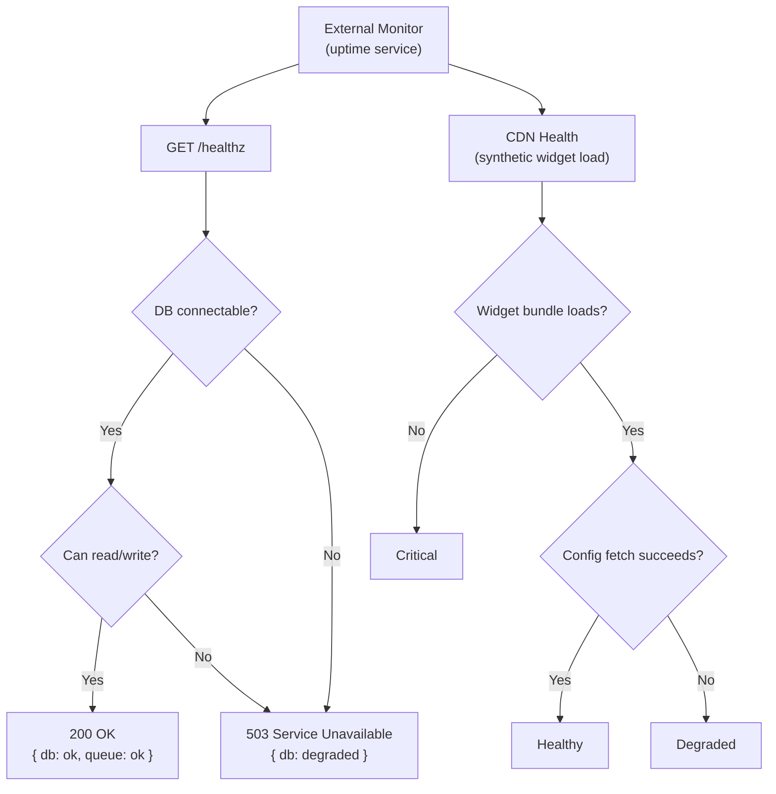

Two monitoring paths:

1. **API health** — A `/healthz` endpoint that verifies database connectivity and job queue responsiveness. Polled by an external uptime monitor. Alerts on failure.

2. **Widget health** — A synthetic monitor that loads a test calculator on a test page, verifies the widget renders, verifies the config fetch succeeds, and verifies a test calculation returns the expected result. This catches issues that the API health check cannot: CDN outages, widget bundle corruption, and config serving failures.

### Key Metrics

| Metric | Source | Alert Threshold |
|--------|--------|----------------|
| API response time (p50, p95, p99) | API server | p95 > 500ms |
| API error rate (5xx) | API server | > 1% of requests |
| Widget bundle load time | Synthetic monitor | p95 > 2s |
| Config fetch error rate | API server + CDN logs | > 0.5% of fetches |
| Submission write error rate | API server | > 0.1% of writes |
| Job queue depth | Job queue metrics | > 1000 pending jobs |
| Job failure rate | Worker logs | > 5% of jobs |
| Database connection pool utilization | API server | > 80% |
| CDN cache hit rate (config endpoint) | CDN analytics | < 90% |
| Certificate expiry | External monitor | < 14 days |

### Error Tracking

Application errors (uncaught exceptions, unhandled promise rejections) are captured with stack traces, request context, and user context, then forwarded to an error tracking service. Errors are deduplicated and grouped. New error groups trigger alerts.

The embeddable widget includes a lightweight error boundary that catches rendering failures and reports them back to the API (fire-and-forget POST to an error reporting endpoint). This gives us visibility into widget failures happening on third-party domains where we have no other instrumentation.

---

## Security

QuoteCraft has a uniquely broad attack surface: we execute JavaScript on third-party domains, accept user-authored logic (formulas, CSS), store end-user PII (lead capture), and process payments. This section catalogs every threat vector and the controls that address it, organized by OWASP Top 10 category where applicable.

### Trust Boundaries

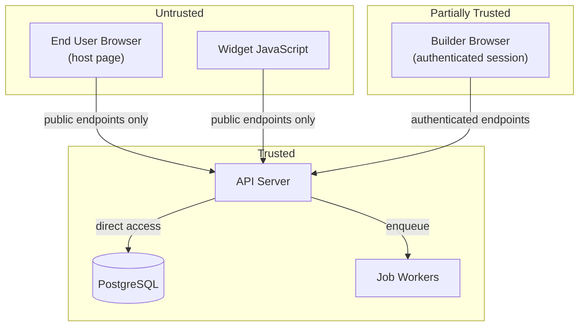

Three trust levels, three sets of rules:

- **Untrusted** — End user browsers and the widget itself. No authentication. Only public endpoints accessible. All input is hostile.
- **Partially Trusted** — Builders with authenticated sessions. Can modify their own resources. Cannot access other builders' data. Input is validated but builder-authored content (formulas, CSS, labels) is treated as potentially malicious when rendered in the widget.
- **Trusted** — Server-side components with direct data store access. All validation happens here, not at the client layer.

### Threat Analysis by OWASP Category

#### A01: Broken Access Control

**Threat:** Builder A accesses or modifies Builder B's calculators, submissions, or account settings.

**Controls:**
- Every API endpoint that operates on a resource (calculator, submission, team) verifies that the authenticated user has ownership or team membership before proceeding. This is not a middleware check on the route — it's a query-level filter. The SQL query itself includes `WHERE user_id = $authenticated_user` or the equivalent team membership join.
- The public config endpoint (`/v1/calculators/:id/config`) does not expose builder account details, billing status, or internal metadata. It returns only the fields the widget needs to render.
- Submission data is scoped to the calculator's owner. There is no endpoint that accepts a submission ID from the client and returns data — the dashboard queries submissions by calculator ID, which is ownership-gated.
- The "Powered by" badge enforcement is server-side. The config response includes the feature flag. Even if a builder modifies their local widget code, the badge state is re-fetched on every load.

#### A02: Cryptographic Failures

**Threat:** Passwords stored in plaintext. Sensitive data exposed in transit. API keys leaked.

**Controls:**
- Passwords are hashed using a memory-hard algorithm (bcrypt or argon2) with per-user salt. Raw passwords are never logged or stored.
- All traffic is TLS-only. HTTP requests are redirected to HTTPS. HSTS headers are set with a long max-age. The widget loader, config fetch, and submission POST all occur over HTTPS. Mixed content is never permitted.
- API keys (Agency tier) are stored as hashed values. The raw key is shown once at creation time and never retrievable again.
- Payment processor credentials, email service API keys, and database connection strings are stored in environment variables or a secrets manager. They are never committed to source control, logged, or included in API responses.
- Lead capture data (name, email, phone) is stored in PostgreSQL. It is not encrypted at the field level in the MVP, but the database connection is TLS-encrypted and the database volume is encrypted at rest.

#### A03: Injection

**Threat:** SQL injection via API inputs. Formula injection executing arbitrary code. CSS injection breaking out of the widget sandbox. XSS via builder-authored labels or messages.

**Controls:**

**SQL Injection:**
- All database queries use parameterized statements. No string interpolation or concatenation is used in SQL construction.
- JSONB values are validated against the config schema before storage. Malformed JSON is rejected.

**Formula Injection:**
- Formulas are parsed into a restricted abstract syntax tree (AST), not evaluated as strings. The parser recognizes only: arithmetic operators, comparison operators, conditional expressions (`IF`), an allow-listed set of math functions (`MIN`, `MAX`, `ABS`, `ROUND`), and variable references by name.
- The AST does not support: string operations, property access, function definitions, assignment, or any construct that could reference browser globals.
- The evaluator is a pure function: `(ast, variables) → number`. It has no side effects, no DOM access, no network access, and no access to anything outside the variable map passed to it.
- Execution is time-bounded. If evaluation exceeds 100ms, it aborts.

**CSS Injection:**
- Builder-authored custom CSS is sanitized before storage and before injection into the Shadow DOM:
  - Strip `@import` and `@font-face` rules (prevent external resource loading).
  - Strip `url()` values (prevent image/font requests to arbitrary servers).
  - Strip legacy IE `expression()` values.
  - Strip `-moz-binding` (legacy Firefox XBL injection vector).
  - Validate that selectors target only elements within the widget's Shadow DOM scope.
- The Shadow DOM itself provides a second layer of containment — even unsanitized CSS inside the shadow root cannot affect the host page.

**XSS (Cross-Site Scripting):**
- Builder-authored text content (field labels, help text, result messages, CTA button labels) is rendered as text nodes, not as innerHTML. HTML in these fields is escaped on output. The builder's "custom message" on the results page supports a restricted rich-text subset (bold, italic, links) — this is rendered from a structured format (not raw HTML), with link URLs validated against an allowlist of schemes (`https:` only).
- The widget's Shadow DOM provides isolation from the host page's DOM. The widget does not read or write to the host page's DOM, cookies, localStorage (except for its own namespaced submission retry queue), or global JavaScript scope.
- The API sets the following response headers on all endpoints:
  - `Content-Type: application/json` (prevents browser MIME sniffing of API responses as HTML)
  - `X-Content-Type-Options: nosniff`
  - `X-Frame-Options: DENY` (on dashboard and marketing site — not on the widget, which must be embeddable)

#### A04: Insecure Design

**Threat:** The free tier's unlimited usage is abused to host spam calculators, phish users, or exfiltrate data via the widget.

**Controls:**
- The "Powered by QuoteCraft" badge on free-tier widgets is server-enforced and links back to QuoteCraft. This creates accountability — abusive calculators are traceable to the builder's account.
- Calculator config is served from our API. If a calculator is flagged as abusive, we can disable it server-side and it stops rendering everywhere instantly (within CDN TTL).
- The widget does not allow arbitrary HTML, JavaScript, or external resource loading. A builder cannot turn a calculator into a phishing page because the only content they control is text labels, numeric values, images from our object storage, and sanitized CSS.
- Image select field images are uploaded through our API and stored in our object storage. We do not allow hotlinking to external image URLs in the widget config, which prevents the widget from becoming an exfiltration vector.

#### A05: Security Misconfiguration

**Controls:**
- The API returns consistent error responses. Stack traces and internal details are never included in production error responses. Errors are logged server-side with full context; the client receives only an error code and a human-readable message.
- Default headers on all API responses: `Strict-Transport-Security`, `X-Content-Type-Options: nosniff`, `X-Frame-Options` (where applicable).
- CORS on public endpoints (config, submissions) uses a wildcard origin (`*`) because the widget must be embeddable on any domain. This is safe because these endpoints do not use cookies or session tokens — they accept only calculator IDs and submission payloads.
- CORS on authenticated endpoints (dashboard API) restricts the origin to the dashboard's domain.
- The API does not expose version information, server software, or technology stack in response headers.

#### A06: Vulnerable and Outdated Components

**Controls:**
- Dependency updates are automated via a bot that opens pull requests for security patches. Critical severity patches are applied within 48 hours.
- The widget bundle has zero runtime dependencies. The only code running on third-party sites is code we wrote and reviewed. This eliminates supply chain risk for the widget specifically.
- The dashboard and API have standard dependency trees. These are audited on every build — the CI pipeline fails if known vulnerabilities are detected in dependencies.

#### A07: Identification and Authentication Failures

**Controls:**
- Authentication endpoints are rate-limited aggressively (10 attempts per minute per IP) to prevent credential stuffing and brute force.
- Password reset tokens are single-use, time-limited (1 hour), and cryptographically random.
- Session tokens have a configurable expiry (e.g., 7 days for "remember me", 24 hours otherwise). Expired tokens are rejected. Logout invalidates the token server-side.
- OAuth flow uses the authorization code grant with PKCE. The API validates the `state` parameter to prevent CSRF during OAuth.
- API keys (Agency tier) are scoped to specific operations (calculator CRUD, submission read). They cannot be used to change account settings, billing, or team membership.

#### A08: Software and Data Integrity Failures

**Controls:**
- Payment processor webhooks are verified by cryptographic signature before processing. Webhook events are deduplicated by event ID to prevent replay attacks.
- The widget loader fetches bundles from a fixed CDN origin. Subresource Integrity (SRI) hashes are included on the loader script tag so the host page can verify the loader hasn't been tampered with. The loader then verifies the full widget bundle's integrity before executing it.
- Database migrations are version-controlled, reviewed, and applied through a controlled pipeline. There is no ad-hoc SQL execution against production.

#### A09: Security Logging and Monitoring Failures

**Controls:**
- All authentication events (login success, login failure, password reset, OAuth) are logged with IP, user agent, and timestamp.
- All authorization failures (403 responses) are logged with the requesting user ID, the resource they attempted to access, and the reason for denial.
- Rate limit violations are logged and, at elevated thresholds, trigger alerts.
- These security events are included in the structured logging pipeline described in the Observability section and are queryable for incident investigation.

#### A10: Server-Side Request Forgery (SSRF)

**Threat:** An attacker tricks the API into making requests to internal services or cloud metadata endpoints.

**Controls:**
- The API does not fetch arbitrary URLs based on user input. The only outbound requests are:
  - To the payment processor's API (hardcoded endpoint).
  - To the email service's API (hardcoded endpoint).
  - To outbound webhook URLs configured by Business/Agency tier builders.
- Outbound webhook URLs (Phase 3) are validated: must be `https://`, must not resolve to private IP ranges (10.x, 172.16-31.x, 192.168.x, 127.x, 169.254.x, ::1), must not target cloud metadata endpoints (169.254.169.254). DNS resolution is checked at send time, not just at configuration time, to prevent TOCTOU attacks where a domain's DNS is changed after validation.

### Data Privacy

Lead capture data (name, email, phone) flows through three points: the widget (collection), the API (transport and storage), and email notifications (delivery). Privacy controls at each point:

| Point | Control |
|-------|---------|
| **Widget (collection)** | Lead capture fields are optional — the builder chooses whether to enable them. The lead form clearly indicates it is the builder's form, not QuoteCraft's. Data is transmitted over HTTPS directly to our API. No data is sent to third parties from the widget. |
| **API (storage)** | Lead data is stored in the submissions table, scoped to the builder's account. QuoteCraft does not use lead data for its own marketing. Free tier data is retained for 30 days. Builders can delete individual submissions from the dashboard. |
| **Email (delivery)** | Lead notification emails are sent via a transactional email service. The email contains the lead's info and is sent only to the builder. PDF quote emails are sent only to the email address the end user provided. |

When a builder deletes their account, all their calculators, submissions (including lead data), and uploaded assets are permanently deleted within 30 days.

### Security Audit Checklist

This checklist is run before each release and periodically on the running system:

| Check | Frequency | Method |
|-------|-----------|--------|
| Dependency vulnerability scan | Every build | Automated in CI |
| OWASP ZAP scan against API | Monthly | Automated |
| Manual review of formula engine sandbox | Every change to formula engine | Code review |
| Manual review of CSS sanitizer | Every change to CSS sanitizer | Code review |
| Penetration test (auth, access control, injection) | Annually or after major changes | Third-party or manual |
| Review of CORS, CSP, and security headers | Every deploy | Automated integration test |
| Verify SRI hashes on widget loader | Every widget deploy | Automated |
| Test rate limiting under load | Quarterly | Load test |

---

## Deployment and Release Strategy

### Widget Versioning

The widget bundle is the most sensitive deployable. A broken widget deploy breaks every live calculator simultaneously. Mitigation:

1. **Immutable, content-hashed bundles** — Each build produces a new filename (e.g., `widget.a1b2c3.js`). Old filenames remain on the CDN indefinitely.
2. **Loader indirection** — The `<script>` tag points to a stable loader URL (`widget-loader.js`). The loader fetches the current version of the full widget bundle. This allows rollback without the builder needing to change their embed code.
3. **Staged rollout** — New widget versions are rolled out gradually: 1% → 10% → 50% → 100% of traffic, with monitoring at each stage. The loader handles version selection based on a rollout configuration served from the CDN.
4. **Rollback** — If monitoring detects elevated error rates after a rollout step, the rollout configuration is reverted to the previous version. This takes effect within the loader's cache TTL (short, e.g., 1 minute).

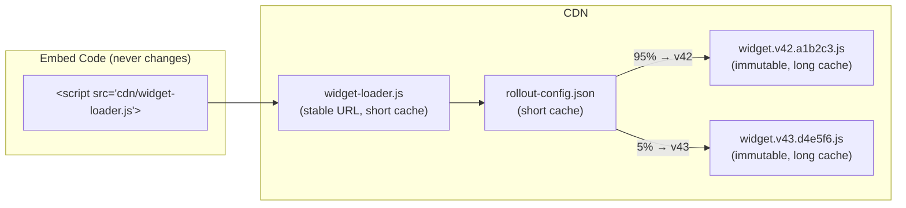

### API Deployments

The API server is stateless. Deployments use a rolling update strategy — new instances start receiving traffic before old instances are drained. Health checks gate traffic routing: a new instance must pass its health check before receiving requests.

Database migrations are forward-only and must be backward-compatible. A new API version must work with both the current and previous database schema. This allows rolling back the API without rolling back the database.

### Marketing Site / Dashboard

Both are static assets served from CDN. Deployments are atomic: a new set of files is uploaded, and the CDN configuration is pointed to the new set. Rollback is pointing back to the previous set.

---

## Scaling Considerations

### What Scales (and What Doesn't Need To)

| Component | Scaling Pressure | Strategy |
|-----------|-----------------|----------|
| CDN | Widget impressions (potentially millions) | Handled by CDN provider — this is their core competency. No action needed. |
| Config endpoint | One fetch per widget load (cacheable) | CDN caching absorbs 90%+. API only handles cache misses. |
| Submission endpoint | One write per calculator completion | Vertical scaling of API server handles this well into growth phase. Horizontal scaling if needed later. |
| Calculator CRUD | One write per builder edit session | Negligible volume. Never a bottleneck. |
| PostgreSQL | Submissions are the highest-write table | Partition submissions table by month for efficient retention cleanup. Index on `calculator_id` and `created_at`. |
| Job queue | One job per notification/PDF | Scales with submissions. Single worker handles early phases. Add workers if queue depth grows. |

### Cost Scaling Profile

The architecture is designed so that the most common operation (widget load + calculation) is the cheapest:

1. **Widget load** — CDN hit (fractions of a cent per 10,000 requests)
2. **Config fetch** — CDN hit most of the time (same cost as above)
3. **Client-side calculation** — Free (runs in the user's browser)
4. **Submission write** — Database insert (the first operation that costs us real compute)
5. **Email notification** — Transactional email service charge (the most expensive per-event operation)

In the common case where an end user loads a calculator, plays with the inputs, and leaves without submitting, we pay for two CDN hits and nothing else. This is what makes unlimited free tier economically viable.

---

## Service Level Objectives

QuoteCraft runs on other people's websites. Downtime or degraded performance directly impacts our builders' businesses — visitors don't get quotes, leads don't come in, revenue is lost. SLOs define the reliability targets we hold ourselves to, and the observability system tells us whether we're meeting them.

### SLO Definitions

We define SLOs for two distinct user journeys because they have different infrastructure paths and different failure impacts:

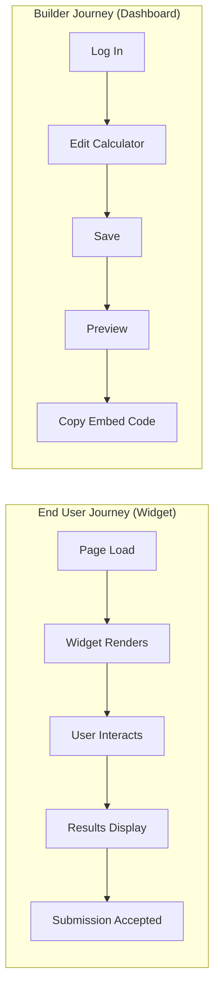

#### Widget Availability (End User Journey)

This is the most critical SLO. When the widget fails, the builder's website visitor sees nothing or a broken placeholder.

| SLO | Target | Measurement | Budget (per month) |
|-----|--------|-------------|-------------------|
| **Widget Load Success Rate** | 99.9% | Percentage of widget loads (CDN bundle fetch + config fetch) that complete without error. Measured by the synthetic monitor and by the widget's error boundary reporting. | 43 minutes of downtime, or ~4,300 failed loads per 4.3M |
| **Widget Load Latency** | p95 < 2 seconds | Time from script execution to calculator fully rendered and interactive. Measured by the synthetic monitor from multiple geographic regions. | — |
| **Submission Acceptance Rate** | 99.5% | Percentage of submission POSTs that receive a 2xx response. Measured at the API server. Lower target than widget load because submissions have a client-side retry mechanism — temporary failures are recovered automatically. | ~3.6 hours of submission endpoint downtime, absorbed by retries |

#### Dashboard Availability (Builder Journey)

Lower target than the widget because the dashboard is a back-office tool, not customer-facing. Builders are inconvenienced by downtime but their live calculators keep working.

| SLO | Target | Measurement | Budget (per month) |
|-----|--------|-------------|-------------------|
| **Dashboard Availability** | 99.5% | Percentage of authenticated API requests that return a non-5xx response. Measured at the API server. | ~3.6 hours |
| **API Latency** | p95 < 500ms | Response time for authenticated API endpoints (calculator CRUD, submission list, settings). Measured at the API server. | — |

#### Email Delivery (Notification Journey)

Email is asynchronous and retried, so availability targets are measured over a longer window.

| SLO | Target | Measurement | Budget (per month) |
|-----|--------|-------------|-------------------|
| **Notification Delivery** | 99% delivered within 5 minutes | Percentage of lead notification emails successfully delivered (accepted by the email service) within 5 minutes of submission. Measured by comparing submission timestamps to email service delivery timestamps. | — |
| **PDF Delivery** | 99% delivered within 10 minutes | Same measurement for PDF quote emails. Higher latency budget because PDF generation adds processing time. | — |

### Error Budgets

Each SLO has an implicit error budget: the amount of unreliability we're allowed before we breach the target. Error budgets are consumed by outages, degraded performance, and elevated error rates.

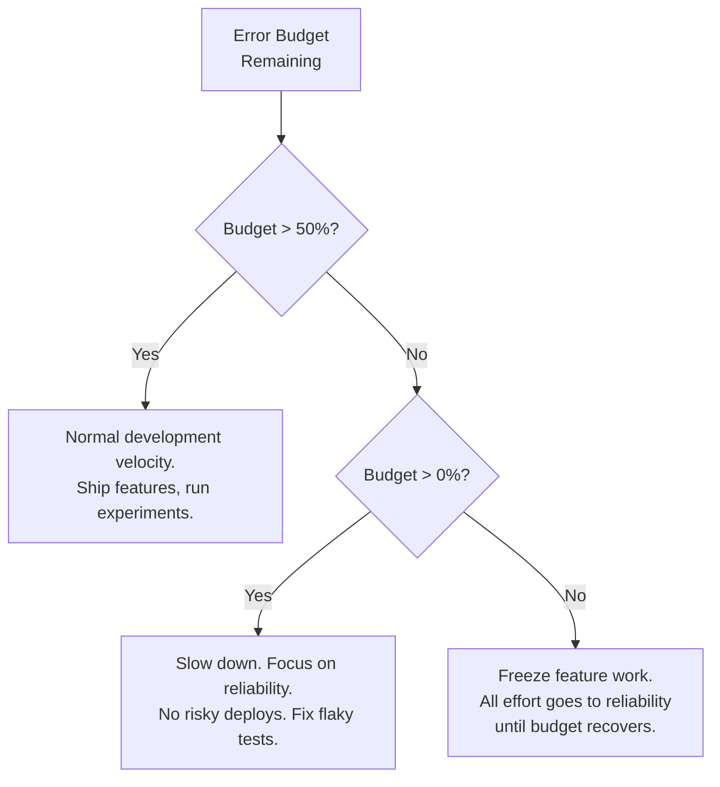

**Policy:**
- When the widget load SLO's error budget is above 50% for the trailing 30-day window, feature development proceeds normally.
- When the budget drops below 50%, we halt non-essential widget deploys and prioritize stability work (performance optimization, error handling, CDN redundancy).
- When the budget is exhausted (SLO breached), all feature work stops until the 30-day trailing window recovers above target. This is the "hard rule" that prevents us from shipping features while the product is broken.
- Dashboard and email SLOs follow the same policy but with less urgency — a dashboard outage is inconvenient, not business-critical.

### Measuring SLOs with the Observability Stack

Each SLO maps directly to metrics already defined in the Observability section. Here's how they connect:

| SLO | Primary Metric | Source | Alert |
|-----|---------------|--------|-------|
| Widget Load Success Rate (99.9%) | `config_fetch_error_rate` + `widget_bundle_load_error_rate` | Synthetic monitor + widget error boundary reports | Error rate > 0.1% over 5-minute window |
| Widget Load Latency (p95 < 2s) | `widget_load_time_p95` | Synthetic monitor | p95 > 2s over 15-minute window |
| Submission Acceptance Rate (99.5%) | `submission_write_error_rate` | API server metrics | Error rate > 0.5% over 5-minute window |
| Dashboard Availability (99.5%) | `api_error_rate_5xx` (authenticated endpoints only) | API server metrics | 5xx rate > 0.5% over 5-minute window |
| API Latency (p95 < 500ms) | `api_response_time_p95` (authenticated endpoints) | API server metrics | p95 > 500ms over 15-minute window |
| Notification Delivery (99% < 5 min) | `notification_delivery_lag_p99` | Job queue metrics + email service delivery logs | p99 > 5 minutes |
| PDF Delivery (99% < 10 min) | `pdf_delivery_lag_p99` | Job queue metrics + email service delivery logs | p99 > 10 minutes |

### SLO Dashboard

A dedicated SLO dashboard provides a single view of current compliance and budget consumption:

```
┌──────────────────────────────────────────────────────────────────┐
│ QuoteCraft SLO Dashboard — Trailing 30 Days                      │
├──────────────────────────┬──────────┬────────┬───────────────────┤
│ SLO                      │ Target   │ Actual │ Budget Remaining  │
├──────────────────────────┼──────────┼────────┼───────────────────┤
│ Widget Load Success      │ 99.9%    │ 99.95% │ ████████░░  82%  │
│ Widget Load Latency p95  │ < 2s     │ 1.3s   │ ██████████  OK   │
│ Submission Acceptance    │ 99.5%    │ 99.8%  │ █████████░  91%  │
│ Dashboard Availability   │ 99.5%    │ 99.7%  │ █████████░  88%  │
│ API Latency p95          │ < 500ms  │ 280ms  │ ██████████  OK   │
│ Notification Delivery    │ 99%<5min │ 99.5%  │ ████████░░  78%  │
│ PDF Delivery             │ 99%<10m  │ 99.6%  │ █████████░  84%  │
└──────────────────────────┴──────────┴────────┴───────────────────┘
```

This dashboard is the first thing checked before approving a deploy, during an incident, and in weekly reliability reviews. It answers the question: "Can we afford to take risks right now, or do we need to play it safe?"

### What SLOs We Don't Set (And Why)

- **No SLO on marketing site uptime.** The template gallery and blog being down doesn't impact existing users. It slows growth but doesn't break anything. We monitor it, but it doesn't gate deploys.
- **No SLO on builder-facing email (password resets, billing receipts).** These are infrequent, low-urgency, and rely on third-party email delivery. We monitor delivery rates but don't set an SLO we can't control.
- **No SLO on CDN cache hit rate.** Cache hit rate is an efficiency metric (cost optimization), not a reliability metric. A low hit rate means we're paying more for origin requests, not that users are impacted. It's tracked in Key Metrics, not in SLOs.
